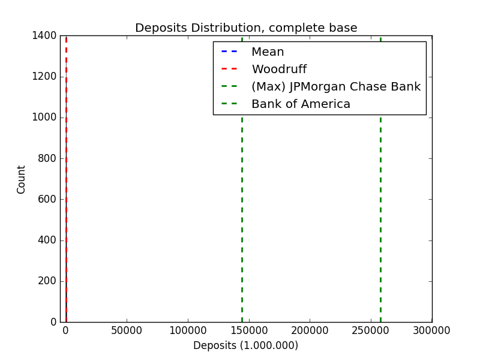
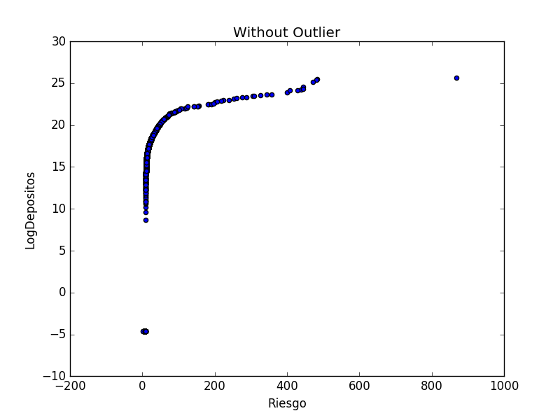
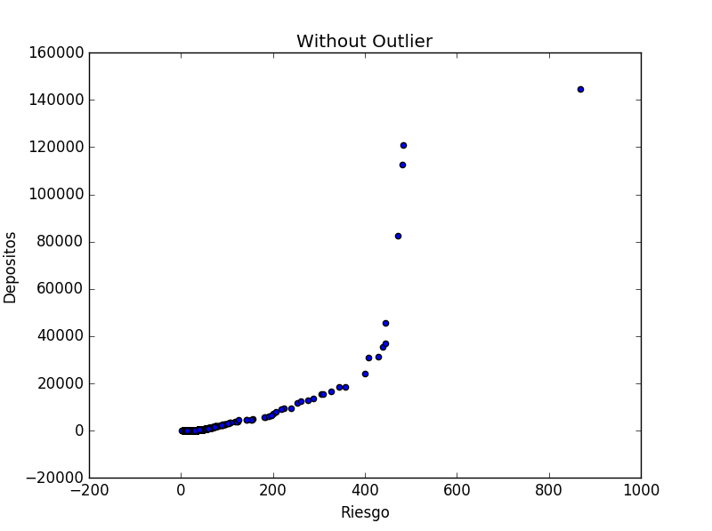

# Analysis of the relation between demand deposits and risks in the American banking sector

[José Gabriel Astaiza]

Noviembre-2016

---

## Description and motivation

USBankLocations.com makes public a compilation of statistics about Tier 1 risk-based capital ratios for all US banks, as well as a compilation of demand deposits statistics for each bank. These statistics are originally collected by various government agencies and USBankLocations.com obtain the data from these government agencies under the Freedom of Information Act. 

For this project I scraped those statistics, which include 6058 banks, and analyzed them using Python.  

Some questions/issues that motivated the project are:

- In the process of issuing deposits and granting loans, financial institutions transform assets characterized by short maturities, small amounts and low risks (deposits) into assets of longer maturities, greater amounts and higher risks (loans).
- Since an important fraction of the illiquid loans of banks are financed through the demand deposits of the uninformed public, then there is always the possibility that depositors excessively withdraw their deposits (i.e., the possibility of a bank run) and the bank face both a liquidity shortage and a higher probability of failure.
- Although bank runs could have a speculative cause, they could also have a fundamental cause, i.e., they could be caused by the bank asset quality.
- The tier 1 capital ratio is the comparison between a banking firm's core equity capital and its total risk-weighted assets. A firm's core equity capital is known as its tier 1 capital and is the measure of a bank's financial strength based on the sum of its equity capital and disclosed reserves, and sometimes non-redeemable, non-cumulative preferred stock. A firm's risk-weighted assets include all assets that the firm holds that are systematically weighted for credit risk.
- What do basic descriptive statistics of the data tell us about the risks of US banks?
- What do basic descriptive statistics of the data tell us about the deposits of US banks?
- Is there a clear relation between the risks and the level of deposits in the United States?

## Methods used

1. Scraping
    - For each bank, the data of demand deposits and the tier 1 capital ratios are available online in the two following websites.
        - Demand deposits:  http://www.usbanklocations.com/bank-rank/demand-deposits---totaldeposits--td-ddt.html
        - Tier 1 capital ratio: www.usbanklocations.com/bank-rank/tier-1-risk-based-capital-ratio---performanceratios--pcr-rbc1rwaj.html
    - To scrape the two websites I used the 'BeautifulSoup' library.
    - The whole Python code is available [here](FinalAssignment_Jose_Astaiza.ipynb)
  
2. Extracting the data from 'BeatifulSoup' objects:
    - Both to scrape the raw text and to extract the data from it, I wrote codes to get urls to deposits and risks; get the names of banks; remove unnecesary symbols; transform the string digits into floats; get the names sorted alphabetically mantaining for each bank the corresponding data.
  
3. Managing, storing, and further cleaning the data:
    - I created lists with the data of banks names, demand deposits and risks and furthered cleaned the data using 'Pandas' methods, regular expressions, etc.
    - I used 'Pandas' to create a data frame with the information of banks, demand deposits, log demand deposits and risks.
    - The complete database or data frame in csv format is available [here](base_completa)
    - There was an important outlier that was identified and droped using the .drop and .index methods.
  
4. Analysing data
    - I used the numpy, math and statsmodels.formula.api libraries to make mathematical operations and run statistical models.
    - Also, I used matplotlib to create figures.
  
5. Sharing the data
    - I created a blog using blogger and changed the html code to make the results avaliable and searchable to the public.
    - You can visit the blog at https://jgastaiza.blogspot.com.co/
    
## Findings

All code for analysis is available [here](FinalAssignment_Jose_Astaiza.ipynb).
 
- Two samples were analysed: the complete sample and the sample without the outlier. This was a strange value correspondig to risk. The  risk outlier is in the position 2768 of the complete data frame and is asociated to HSBC,Delaware (36197%). It is important to notice that the second highest risk is just 868.6%.

- The descriptive statistics of the complete data base are:
<pre>
             Riesgo      Depositos  LogDepositos
count   6058.000000    6058.000000   6058.000000
mean      25.402773     260.465357     16.823795
std      465.535237    4658.603264      2.944915
min        1.594700       0.000000     -4.605170
25%       12.478850      12.457000     16.337793
50%       15.109700      25.842000     17.067512
75%       19.728750      55.820250     17.837647
max    36197.297300  258094.000000     26.276590 
</pre>
- The descriptive statistics of the data base without the outlier are:
<pre>
            Riesgo      Depositos  LogDepositos
count  6057.000000    6057.000000   6057.000000
mean     19.430857     217.897496     16.822234
std      25.922823    3275.228433      2.942652
min       1.594700       0.000000     -4.605170
25%      12.478500      12.457000     16.337793
50%      15.109400      25.839000     17.067396
75%      19.724400      55.815000     17.837553
max     868.623800  144521.000000     25.696691
</pre>

- The linear relation between demand deposits and risks according to the entire sample is:

<pre>
                            OLS Regression Results                            
==============================================================================
Dep. Variable:              Depositos   R-squared:                       0.550
Model:                            OLS   Adj. R-squared:                  0.550
Method:                 Least Squares   F-statistic:                     7413.
Date:                Mon, 14 Nov 2016   Prob (F-statistic):               0.00
Time:                        15:16:20   Log-Likelihood:                -57343.
No. Observations:                6058   AIC:                         1.147e+05
Df Residuals:                    6056   BIC:                         1.147e+05
Df Model:                           1                                         
Covariance Type:            nonrobust                                         
==============================================================================
                 coef    std err          t      P>|t|      [95.0% Conf. Int.]
------------------------------------------------------------------------------
Intercept     71.8779     40.197      1.788      0.074        -6.923   150.679
Riesgo         7.4239      0.086     86.098      0.000         7.255     7.593
==============================================================================
Omnibus:                    16507.981   Durbin-Watson:                   1.994
Prob(Omnibus):                  0.000   Jarque-Bera (JB):        413211942.356
Skew:                          33.826   Prob(JB):                         0.00
Kurtosis:                    1280.672   Cond. No.                         467.
==============================================================================

Warnings:
[1] Standard Errors assume that the covariance matrix of the errors is correctly specified.
</pre>

- The linear relation between demand deposits and risks according to the sample without the outlier is (observe that the R-squared and the slope notably increase):

<pre>
                            OLS Regression Results                            
==============================================================================
Dep. Variable:              Depositos   R-squared:                       0.659
Model:                            OLS   Adj. R-squared:                  0.659
Method:                 Least Squares   F-statistic:                 1.170e+04
Date:                Mon, 14 Nov 2016   Prob (F-statistic):               0.00
Time:                        15:16:24   Log-Likelihood:                -54362.
No. Observations:                6057   AIC:                         1.087e+05
Df Residuals:                    6055   BIC:                         1.087e+05
Df Model:                           1                                         
Covariance Type:            nonrobust                                         
==============================================================================
                 coef    std err          t      P>|t|      [95.0% Conf. Int.]
------------------------------------------------------------------------------
Intercept  -1775.1024     30.714    -57.795      0.000     -1835.312 -1714.893
Riesgo       102.5688      0.948    108.184      0.000       100.710   104.427
==============================================================================
Omnibus:                    13365.358   Durbin-Watson:                   2.014
Prob(Omnibus):                  0.000   Jarque-Bera (JB):        135899781.270
Skew:                          19.864   Prob(JB):                         0.00
Kurtosis:                     735.738   Cond. No.                         40.5
==============================================================================

Warnings:
[1] Standard Errors assume that the covariance matrix of the errors is correctly specified.
</pre>

Here some visualizations of key findings:

---
